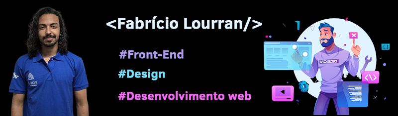

<h2>Fabrício Lourran</h2>

 Olá! Meu nome é Fabrício e sou estundante universitário 
    em ciência da computação pela universidade federal fluminense.
    Atualmente sou desenvolvedor front-end pela Focus Consultoria 
    (empresa júnior da minha faculdade).

<h2>Um pouco da minha experiência 📚:</h2>

    Dentro da Focus eu pude desenvolver hard skills, como o SCRUM,
    liderança, precificação de projetos, criação de cronograma para
    os projetos e também me desenvolver na área de front-end, que é 
    meu foco. Além disso, com a faculdade adquiri experiência em 
    programação de sistemas embarcados.

<h3>Tecnologias que eu utilizo 💻:</h3>

    
    
    
    
    

<h3>Tecnologias que estou estudando 💻:</h3>

    
    

<h2>Exemplo do meu trabalho 👨‍💻:</h2>

<h2>Minhas redes para contato:</h2>

    
    </a>
    
    </a>

<a href="https://www.freepik.com">designed by Upklyak - Freepik.com</a>

